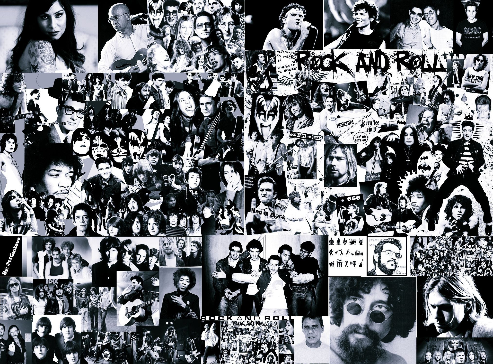

# 🤘 Six Strings

> **🎸 Legends • 🎶 Riffs • 👑 Legacy**

<p align="center">
  
</p>

Six Strings is a modern full-stack web application inspired by the bands that defined rock and heavy metal. Built with a focus on clean design, smooth interactions, and scalable architecture, it's where my passion for music meets my passion for building.

---

## ⚡ Tech Stack

- ▲ Next.js
- 📘 TypeScript
- 🎨 Tailwind CSS
- 🍃 MongoDB
- 🦫 Mongoose
- ✨ Framer Motion

---

## 🎵 What's Inside?

```text
🏠 Home

🔍 Search legendary bands

🎸 Explore band profiles

💿 Browse iconic albums

❤️ Build your favorites
```

---


## 🧠 Principles

- Keep the UI clean.
- Keep the code scalable.
- Let the music speak.

---

> *Built with code. Powered by riffs.*